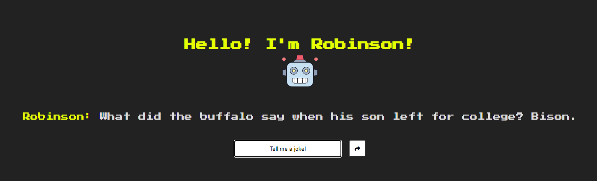

# Implementation of a Contextual Chatbot in PyTorch.  
Simple chatbot implementation with PyTorch. 

- The implementation should be easy to follow for beginners and provide a basic understanding of chatbots.
- The implementation is straightforward with a Feed Forward Neural net with 2 hidden layers.
- Customization for your own use case is super easy. Just modify `intents.json` with possible patterns and responses and re-run the training (see below for more info).

The approach is inspired by this [article](https://chatbotsmagazine.com/contextual-chat-bots-with-tensorflow-4391749d0077), and the NLP model here is based on the repository of [@python-engineer](https://github.com/python-engineer/pytorch-chatbot).

## General info

The chatbot here uses Bag of Words representation for extracting features from text and use in modeling. And I used Flask and Heroku to provide the chatbot online. You can check it out [here]().  

## Screenshots


## Technologies
* PyTorch
* NLTK
* Flask

## Installation

### Create an environment
Whatever you prefer (e.g. `conda` or `venv`)
```console
mkdir myproject
$ cd myproject
$ python3 -m venv venv
```

### Activate it
Mac / Linux:
```console
. venv/bin/activate
```
Windows:
```console
venv\Scripts\activate
```

### Install PyTorch and dependencies
For installation of PyTorch and Flask see [official PyTorch website](https://pytorch.org/)and [official Flask website](https://flask.palletsprojects.com/en/1.1.x/installation/).

You also need `nltk`:
 ```console
pip install nltk
 ```

If you get an error during the first run, you also need to install `nltk.tokenize.punkt`:
Run this once in your terminal:
 ```console
$ python
>>> import nltk
>>> nltk.download('punkt')
```

## Usage
Run
```console
python src/train.py
```
This will dump `data.pth` file. And then run
```console
python src/chat.py
```

## Customize
Have a look at [intents.json](intents.json). You can customize it according to your own use case. Just define a new `tag`, possible `patterns`, and possible `responses` for the chat bot. You have to re-run the training whenever this file is modified.
```console
{
  "intents": [
    {
      "tag": "greeting",
      "patterns": [
        "Hi",
        "Hey",
        "How are you",
        "Is anyone there?",
        "Hello",
        "Good day"
      ],
      "responses": [
        "Hey :-)",
        "Hello, thanks for visiting",
        "Hi there, what can I do for you?",
        "Hi there, how can I help?"
      ]
    },
    ...
  ]
}
```
